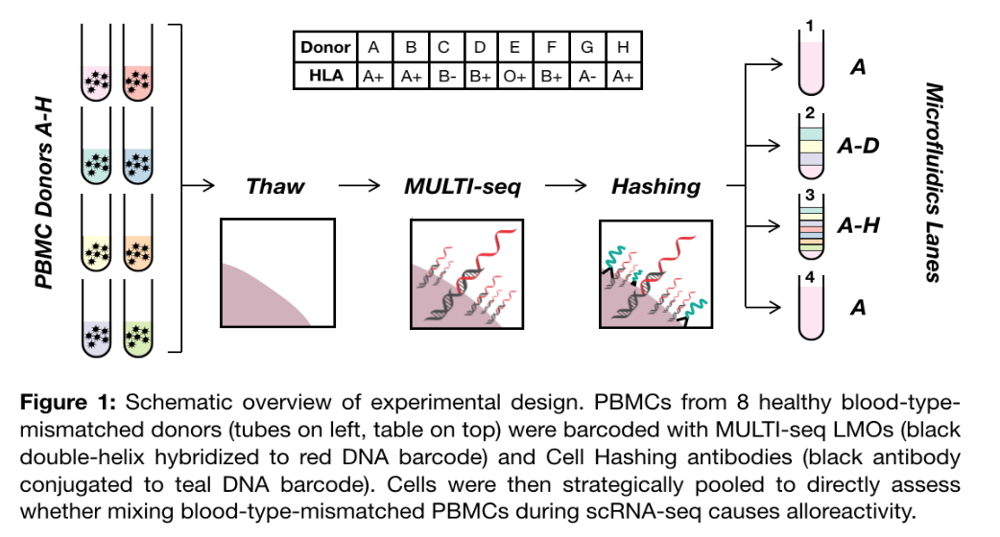

# Companion code for PBMC Alloreactivity Manuscript

## Datasets

1. 8-donor PBMC -- 4 10x lanes, 1/4/8/1 donors per lane, tagged with MULTI-seq and SCMK reagents
2. 7-donor PBMC -- 1 10x lane, 7 donors, tagged with SCMK reagents alone
3. Zheng et al PBMC -- 3 10x lanes, 1/2/1 donors per lane ("Frozen PBMCs (Donor B)", "Frozen PBMCs (Donor C)", and "50%:50% Donor B: Donor C PBMC Mixture" from https://support.10xgenomics.com/single-cell-gene-expression/datasets) 
4. BD PBMC +/- CD3/CD28 PBMCs -- "WTA + Sample Multiplexing + AbSeq" from https://scomix.bd.com/hc/en-us/articles/360034192672-Rhapsody-WTA-Demo-Datasets

## Summary of files:

PreProcessing.R : (i) RNA, MULTI-seq, and SCMK data pre-processing and quality-control for all datasets, (ii) DoubletFinder for 8-donor and Zheng et al datasets, and (iii) Cell type annotations and CD4+ T-cell subtype annotations for all datasets.

SampleClassification.R : (i) deMULTIplex classification for MULTI-seq and SCMK count matrices for 8-donor and 7-donor PBMC datasets, (ii) barcode space computations for 8-donor PBMC dataset, (iii) demuxEM classification for MULTI-seq and SCMK count matrices for 8-donor PBMC dataset, and (iv) souporcell in silico genotyping for 8-donor and Zheng et al PBMC datasets.

TrimaAnalysis.R : (i) Characterization of Trima filtration signature in 8-donor PBMC dataset.

GSEA.R: (i) Computation of signed p-values for all expressed genes in each PBMC cell type and CD4+ T-cell subtype for 8-donor and Zheng et al PBMC datasets, and (ii) Identification of enriched gene sets for each (un)mixed PBMC cell type and CD4+ T-cell subtype.

ProportionTests.R : (i) Computation of PBMC cell type and CD4+ T-cell subtype frequencies for 8-donor and Zheng et al PBMC datasets, and (ii) Pairwise proportion tests for PBMC cell type and CD4+ T-cell subtype frequencies.

Alloreactivity.R : (i) Iterative computation (n=100) of UMAP embeddings for each PBMC cell type following down-sampling to control for proportional differences for 8-donor and Zheng et al PBMC datasets, (ii) Jensen Shannon Divergence (JSD) computation across sets of UMAP embeddings, (iii) JSD after donor label permutation, and (iv) Computation of JSD summary statistics. 

Visualizations.R : Source code for all visualizations included in manuscript.

 
